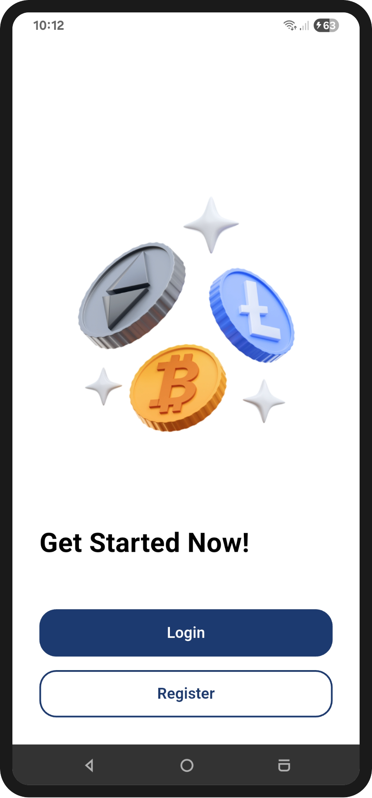
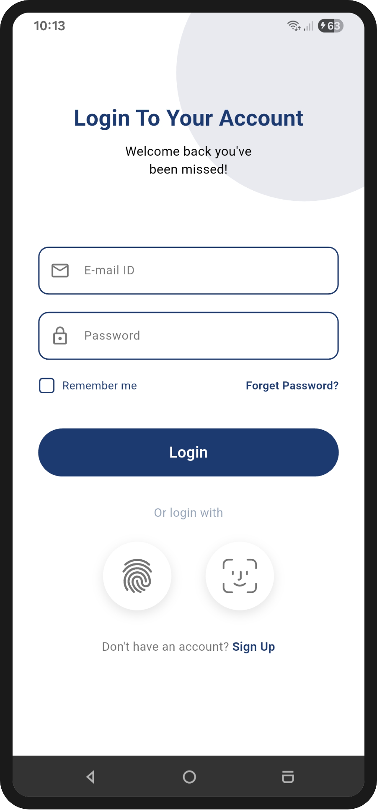
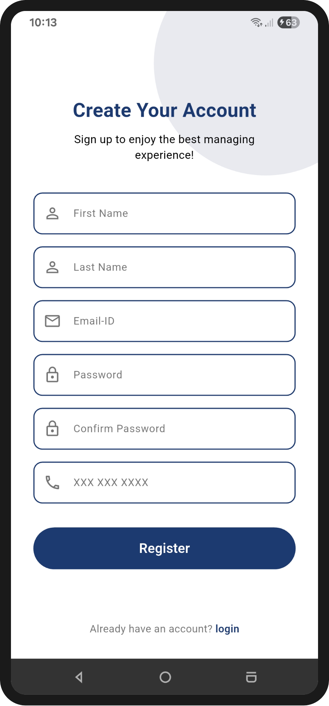
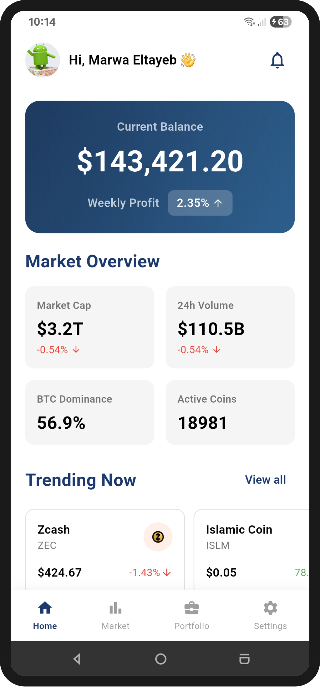
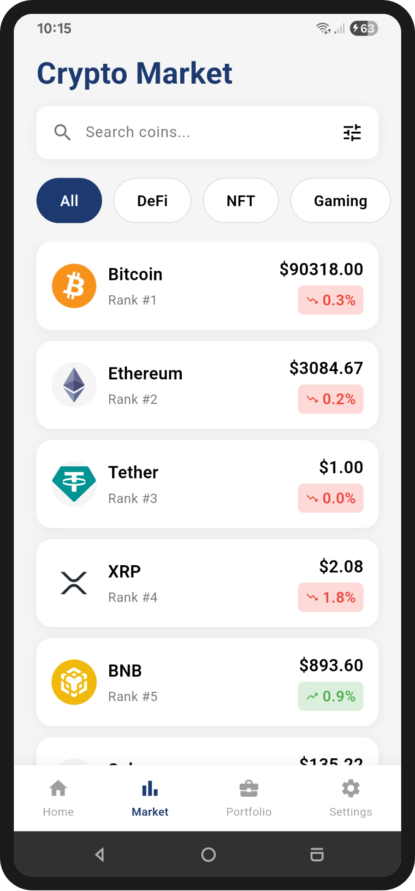
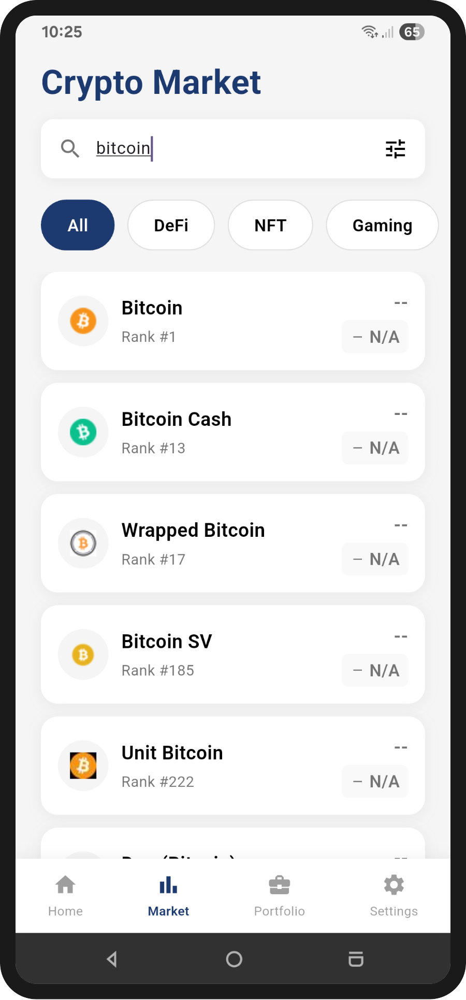
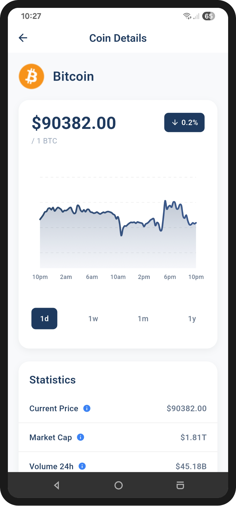
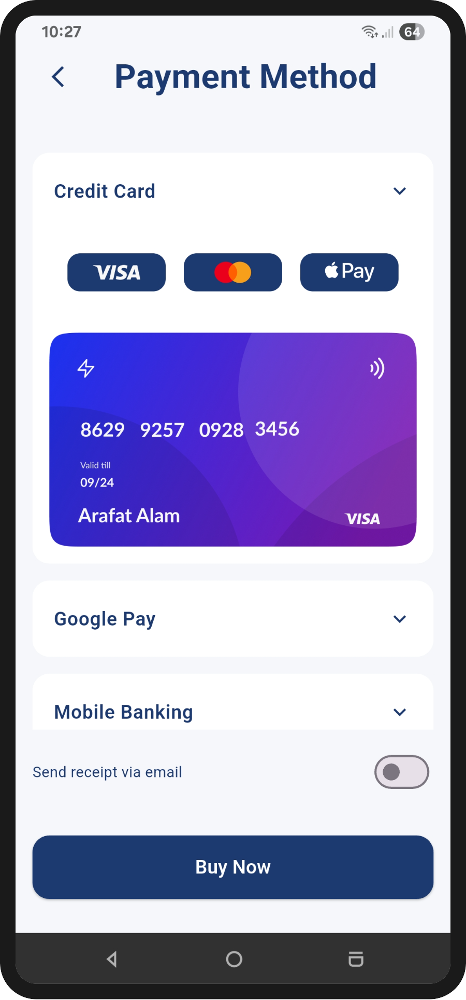
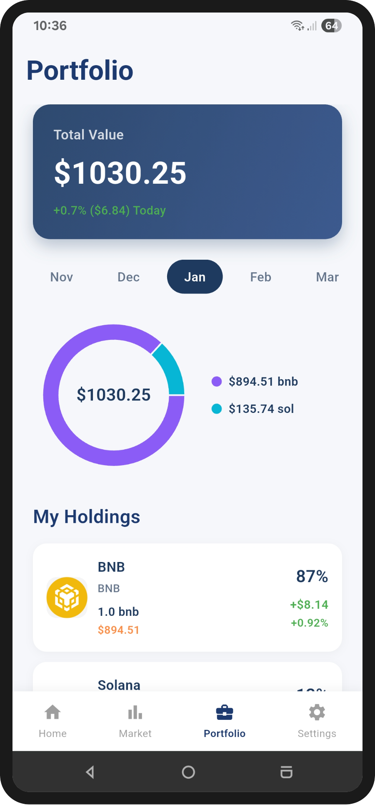

# 💰 Crypto Tracker App

A Flutter application for tracking cryptocurrency markets and managing your portfolio. 

## 📋 Overview

Crypto Tracker is a comprehensive cryptocurrency management platform that helps users monitor market trends, track their portfolio, and make informed decisions. The app features real-time market data, advanced search, portfolio analytics, secure authentication with biometrics, and integrated payment processing. Built with CoinGecko API and following feature-first architecture principles for maintainability and scalability.

## 🛠️ Tech Stack

- **Flutter** – Cross-platform mobile framework
- **Dio** – HTTP client for API integration
- **flutter_bloc (Cubit)** – State management
- **get_it** – Dependency injection
- **go_router** – Navigation & routing
- **Firebase** (Core, Auth) – Authentication & backend services
- **local_auth** – Biometric authentication (Face ID, Fingerprint)
- **flutter_secure_storage** – Secure credential storage
- **shared_preferences** – Persistent user preferences
- **cached_network_image** – Image caching
- **flutter_svg** – SVG asset support
- **url_launcher** – Open web links and email actions
- **fl_chart** – Charts and data visualization
- **device_info_plus** – Device and platform information
- **root_check_flutter** – Root detection
- **flutter_dotenv** – Environment variable management
- **mailer** – Sending emails from the app
- **crypto** – Cryptographic utilities (hashing, encryption helpers)

## 🏗️ Architecture

The app follows **Feature-First Architecture** with clean separation of concerns:

```
lib/
├── 🎯 core/                 # Shared utilities
│   ├── constants/            # Assets, strings, templates
│   ├── di/                   # Dependency injection
│   ├── errors/               # Error handling
│   ├── network/              # API client setup
│   ├── security/             # Security utilities
│   ├── storage/              # Local storage
│   ├── utils/                # Helpers & validators
│   └── widgets/              # Reusable UI components
│
├── 📱 config/                # App configuration
│   ├── routing/              # Navigation setup
│   └── theme/                # Theme & styling
│
└── ✨ features/              # Feature modules
    │
    ├── 🔐 auth/              # Authentication & Security
    │   ├── data/             # Firebase integration, models
    │   └── presentation/     # UI (Cubit + Screens)
    │
    ├── 🏠 home/              # Home & Market Overview
    │   ├── data/
    │   └── presentation/
    │
    ├── 📊 market/            # Market Search & Browse
    │   ├── data/
    │   └── presentation/
    │
    ├── 📋 details/           # Coin Details & Charts
    │   ├── data/
    │   └── presentation/
    │
    ├── 💼 portfolio/         # Portfolio Management
    │   ├── data/
    │   └── presentation/
    │
    ├── 💳 payment/           # Payment Processing
    │   ├── data/
    │   └── presentation/
    │
    ├── ⚙️ settings/          # Settings & Profile
    │   └── presentation/
    │
    ├── 👋 onboarding/        # First-time Experience
    │   ├── data/
    │   └── presentation/
    │
    └── 🚀 splash/            # Splash Screen
        └── presentation/
```

Each feature follows **2-layer architecture**:
- **Data Layer**: API integration, local storage, models, repository implementations
- **Presentation Layer**: Cubit state management, screens, widgets

## ✨ Features

### 🔐 Authentication & Security
- User registration and login with Firebase Auth
- Biometric authentication (Face ID, Fingerprint)
- Secure credential storage with encryption
- Root Detection
- Session management
- Password recovery

### 🏠 Home Dashboard
- Real-time market overview
- Portfolio balance summary
- Top gainers and losers
- Trending cryptocurrencies
- Global market statistics
- Quick access to key metrics

### 📊 Market Browser
- Browse all cryptocurrencies
- Real-time price updates
- Advanced search functionality
- Filter by category (DeFi, NFT, Gaming, etc.)
- Sort by market cap, volume, price change
- Add coins to portfolio

### 📋 Coin Details
- Comprehensive coin information
- Interactive price charts
- Multiple timeframes (24h, 7d, 30d, 1y, All)
- Price change indicators
- Market statistics (Market cap, Volume, Supply)
- Buy/Sell actions

### 💼 Portfolio Management
- Track multiple holdings
- Add/remove holdings with custom amounts
- Real-time portfolio value calculation
- Portfolio distribution pie chart
- Transaction history
- Monthly performance tracking
- Profit/loss analysis

### 💳 Payment Integration
- Credit card payment support (Visa, Mastercard)
- Multiple payment methods
- Card preview and validation
- Email receipt delivery
- Secure payment processing
- Apple Pay integration

### ⚙️ Settings & Profile
- User profile management
- Gravatar integration for avatars
- Account settings
- Security preferences
- App theme customization
- Logout with confirmation

### 👋 Onboarding
- Intuitive first-time user experience
- Step-by-step guide
- Feature highlights
- Smooth page transitions

## 📸 Screenshots
<p align="left">
  
  
  
</p>

<p align="left">
  
  
  
</p>

<p align="left">
  
  
  
</p>

## 👤 Author

- GitHub: [@marwa-eltayeb](https://github.com/marwa-eltayeb)

